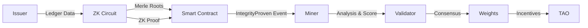

# ZK Stablecoin Bittensor Subnet

> **"ZK enforces facts, Bittensor enforces meaning."**

A monetary-integrity intelligence market where proofs are private, but verification is public.

## 🌟 Why Bittensor?

Zero-Knowledge proofs are essentially just **math**. A smart contract can verify that $(a \times b) = c$, but it cannot verify **Context** or **Quality**.

We use Bittensor to bridge the gap between "Cryptographically Valid" and "Financially Healthy":

1.  **Liveness Verification**: A proof might be valid, but if the issuer's data API is offline, transparency is zero. Miners verify availability.
2.  **Policy Enforcement**: Issuers might try to generate valid proofs using *outdated* policies (e.g., 100% collateral instead of 150%). Miners enforce the *latest* policy.
3.  **Risk Analysis**: A proof is binary (Permit/Revert). An Integrity Score is a spectrum (0.0 to 1.0). Miners compete to calculate the most accurate risk attributes.

---

## 🏗️ Architecture



## 🛠️ Project Structure

*   `zk/` — **The Truth Machine**. Circom circuits (`solvency.circom`, `supply.circom`) proving assets $\ge$ liabilities.
*   `contracts/` — **The Registry**. Solidity contracts (`IntegrityRegistry.sol`) storing proof commitments.
*   `subnet/` — **The Intelligence**. Python code for Miners (analyzers) and Validators (scorers).
*   `issuer/` — **The Prover**. Private pipeline for issuers to connect their SQL/Ledger to ZK generation.
*   `web/` — **The Window**. Next.js 16 dashboard visualizing the integrity scores.

---

## ⛏️ How to Mine (Become a Miner)

Miners in this subnet act as **Decentralized Auditors**. You don't need the private data; you verify the public artifacts.

### 1. Requirements
*   **Hardware**: Min. 16GB RAM, 8 vCPU (for fast Groth16 verification).
*   **Wallet**: A Bittensor wallet with a registered hotkey.
*   **Code base**: This repository.

### 2. Setup Miner
```bash
# Clone and install
git clone https://github.com/mizan-labs/mizan-subnet
cd mizan-subnet
pip install -e .

# Configure wallet (requires registration)
export WALLET_NAME="mywallet"
export WALLET_HOTKEY="myhotkey"
```

### 3. Start Mining
```bash
python -m subnet.miner.main \
  --wallet.name $WALLET_NAME \
  --wallet.hotkey $WALLET_HOTKEY \
  --netuid <subnet_uid>
```

### 4. How to Win (Get Rewards)
*   **Be Fast**: Validate new proofs as soon as they appear in the mempool/event logs.
*   **Be Accurate**: Do not validate proofs that use outdated Policy Hashes (see `contracts/PolicyRegistry.sol`).
*   **Be Available**: Ensure your Axon is open for Validator queries.

---

## 🚀 Quick Start (Development)

### Prerequisites
*   Node.js 20+
*   Rust (for Circom)
*   Python 3.10+
*   Foundry

### 1. Install Dependencies
```bash
# ZK Circuits
cd zk && npm install

# Subnet (Python)
cd ../subnet && pip install -e .

# Web Dashboard
cd ../web && npm install

# Smart Contracts
cd ../contracts && forge install
```

### 2. Compile Circuits
```bash
cd zk
npm run compile:all
```

### 3. Run Web Dashboard
```bash
cd web
npm run dev
```

---

## 📚 Documentation

Detailed documentation is available in `docs/` or via the [Web Dashboard /docs](http://localhost:3000/docs):

*   [System Architecture](docs/architecture.md)
*   [ZK Circuit Design](docs/zk_design.md)
*   [Subnet Economics](docs/subnet_economics.md)
*   [Integration Guide](docs/integration_guide.md)
