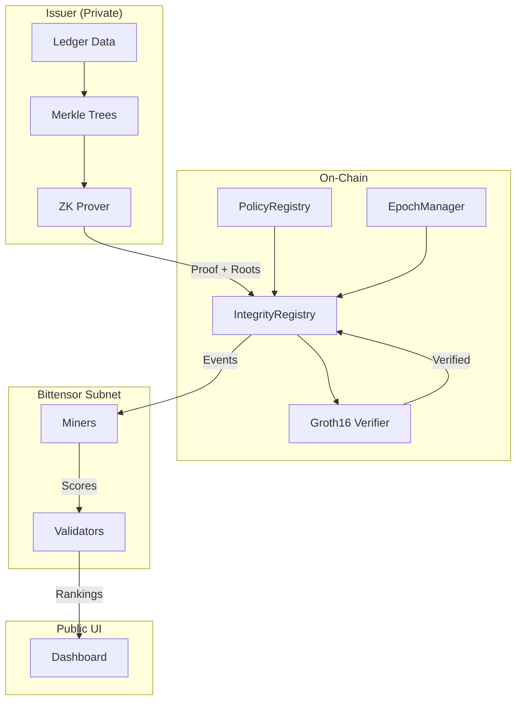

# Mizan ZK Stablecoin Subnet Architecture

## Overview



## Components

### 1. ZK Layer (`zk/`)

**Circuits:**
- `solvency.circom` - Proves collateral ≥ liabilities × ratio
- `supply.circom` - Proves minted ≤ authorized supply
- `risk_bounds.circom` - Proves asset ratios within bounds
- `epoch.circom` - Aggregates all proofs for epoch

**Key Properties:**
- Poseidon hashing (ZK-friendly)
- 20-level Merkle trees (~1M leaves)
- Policy-hash binding prevents replay

### 2. Smart Contracts (`contracts/`)

| Contract | Purpose |
|----------|---------|
| `IntegrityRegistry` | Stores epoch proofs, emits events |
| `PolicyRegistry` | Manages policy versions |
| `EpochManager` | Enforces timing, slashing |
| `Groth16Verifier` | Cryptographic verification |

**No balances stored on-chain.**

### 3. Subnet (`subnet/`)

**Miner Role:**
- Analyze proof quality
- Score constraint coverage
- Detect edge cases
- Cannot see private data

**Validator Role:**
- Verify proofs cryptographically
- Aggregate miner scores
- Rank miners
- Distribute TAO rewards

### 4. Issuer Pipeline (`issuer/`)

```
ledger/ → merkle/ → prove/ → submit/
```

Private data never leaves issuer infrastructure.

## Epoch Flow

1. **Issuer** updates ledger, builds Merkle trees
2. **Issuer** generates ZK proof
3. **Issuer** submits proof + roots to IntegrityRegistry
4. **Contract** verifies proof via Groth16Verifier
5. **Contract** emits `IntegrityProven` event
6. **Miners** analyze proof, generate scores
7. **Validators** aggregate scores, rank miners
8. **TAO** distributed to top miners
9. **Web UI** displays integrity scores

## Security Model

### Trust Assumptions

- **ZK Circuit**: Must be correctly specified
- **Issuer**: Provides accurate witness data
- **Miners**: Compete to find weaknesses
- **Validators**: Honest majority

### Threat Mitigations

| Threat | Mitigation |
|--------|------------|
| Proof omission | Score decay + slashing |
| Stale submission | Epoch monotonicity |
| Under-specified circuit | Policy versioning |
| Policy downgrade | Minimum version check |
| Miner collusion | Stake + diversity |

## Forking

Create private deployment by:
1. Reusing circuits
2. Changing policy hash
3. Running private subnet
4. Optional private validators

Nothing in the architecture prevents this.
